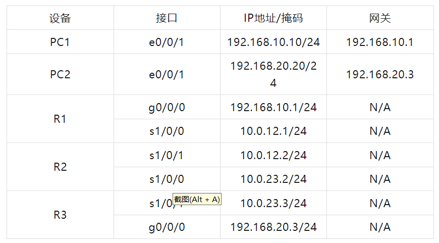

## 实验介绍

**静态路由和默认路由**

静态路由和默认路由都是路由协议的一种，它们在计算机网络中用于决定数据包的传输路径。

静态路由是由网络管理员手动配置的路由规则，它不会改变。静态路由会告诉路由器如何将数据包从一个网络转发到另一个网络。

默认路由是一种特殊的静态路由，它指定了一个路由器作为默认路由，即当数据包没有指定目标网络时，路由器将使用默认路由来转发数据包。默认路由有助于优化路由器的性能和网络带宽的使用，因为它可以将数据包发送到最合适的目标网络，而不需要经过更多的路由查找过程。

因此，静态路由和默认路由在计算机网络中通常一起使用，以实现更高效的数据包转发和网络连接。

<!--truncate-->

### 实验目的

- 掌握配置静态路由(指定下一跳IP 地址)的方法
- 掌握配置静态路由(指定接口)的方法
- 掌握测试静态路由连通性的方法
- 掌握配置默认路由的方法
- 掌握测试默认路由的方法
- 掌握在简单网络中部署静态路由时的故障排除方法
- 掌握简单的网络优化方法

### 实验内容

在由3台路由器所组成的简单网络中，R1与R3各自连接着一台主机，现在要求能够实现主机PC-1与PC-2之间的正常通信。本实验将通过配

### 实验拓扑


### 实验编址




## 实验配置

### 基本配置


根据实验编址表进行相应的基本配置，并使用ping命令检测各直连链路的连通性。

```
[r1]int g0/0/0

[r1-GigabitEthernet0/0/0]ip add 192.168.10.1 24

[r1]int s 1/0/0

[r1-Serial1/0/0]ip add 10.0.12.1 24


[r2]int s1/0/1

[r2-Serial1/0/1]ip add 10.0.12.2 24

[r2]int s1/0/0

[r2-Serial1/0/0]ip add 10.0.23.2 2

[r3]int s1/0/1

[r3-Serial1/0/1]ip add 10.0.23.3 24

[r3]int g0/0/0

[r3-GigabitEthernet0/0/0]ip add 192.168.20.3 24
```


各直连链路间的IP连通性测试完成后，现尝试在主机PC-1上直接ping主机PC-2。


发现无法连通，这时需要思考是什么问题导致了它们之间无法通信。

首先假设主机PC-1与PC-2之间如果能够正常连通，那么主机A将发送数据给其网关设备R1;R1收到后将根据数据包中的目的地址查看它的路由表，找到相应的目的网络的所在路由条目，并根据该条目中的下一跳和出接口信息将该数据转发给下一台路由器R2;R2采取同样的步骤将数据转发给R3;最后R3也采取同样的步骤将数据转发给与自己直连的主机PC-2;主机PC-2在收到数据后，与主机PC-1发送数据到PC-2的过程一样，再发送相应的回应消息给PC-1。

在保证基本配置没有错误的情况下，首先查看主机PC-1与其网关设备R1间能否正常通信。


主机与网关之间通信正常，接下来检查网关设备R1上的路由表。

```
<r1>display ip routing-table
```


可以看到在R1的路由表上，没有任何关于主机PC-2所在网段的信息。可以使用同样的方式查看R2与R3的路由表


可以看到在R2上没有任何关于主机PC-1和PC-2所在网段的信息，R3上没有任何关于主机PC-1所在网段的信息，验证了初始情况下各路由器的路由表上仅包括了与自身直接相连的网段的路由信息。

现在主机PC-1与PC-2之间跨越了若干个不同网段，要实现它们之间的通信，只通过简单的IP地址等基本配置是无法实现的，必须在3台路由器上添加相应的路由信息,可以通过配置静态路由来实现。

配置静态路由有两种方式，一种是在配置中采取指定下一跳IP地址的方式，另一种是指定出接口的方式。

### 配置静态路由(实现主机PC-1与PC-2之间的通信)

在 R1 上配置目的网段为主机 PC-2所在网段的静态路由，即目的IP 地址为192.168.20.0，掩码为255.255.255.0。

对于R1而言，要发送数据到主机PC-2，则必须先发送给R2，所以R2即为R1的下一跳路由器，R2与R1所在的直连链路上的物理接口的IP地址即为下一跳IP地址，即10.0.12.2.

```
[r1]ip route-static 192.168.20.0 24 10.0.12.2 
```

配置完成后，查看R1上的路由表。

```
<r1>display ip routing-table
```


配置完成后，可以在R1的路由表上查看到主机PC-2所在网段的路由信息。

采取同样的方式在R2上配置目的网段为主机PC-2所在网段的静态路由。

```
[r2]ip route-static 192.168.20.0 24 10.0.23.3
```

```
<r2>display ip routing-table
```


在R3上配置目的网段为PC-1所在网段的静态路由，即目的IP地址为192.168.10.0，目的地址的掩码除了可以采用点分十进制的格式表示外，还可以直接使用掩码长度，即24来表示。

对于R3而言，要发送数据到PC-1，则必须先发送给R2，所以R3与R2所在直连链路上的物理接口S 0/0/1即为数据转发接口，也称为出接口，在配置中指定该接口即可。

```
[r3]ip route-static 192.168.10.0 24 Serial 1/0/1
```

采取同样的方式在R2上配置目的网段为PC-1所在网段的静态路由。

```
[r2]ip route-static 192.168.10.0 24 Serial 1/0/1
```

配置完成后，查看R1、R2、R3上的路由表。


可以看到，现在每台路由器上都拥有了主机PC-1与PC-2所在网段的路由信息。

再在主机PC-1上ping主机PC-2。


### 实现全网全通来增强网络的可靠性

经过上面的步骤，主机PC-1与PC-2之间已经能够正常通信。

假设此时网络突然出现故障，主机PC-1侧的网络管理员发现无法与PC-2正常通信，于是先测试与网关设备R1间的连通性。


发现无法与R3正常通信，这也意味着此时网络管理员将无法通过主机PC-1登录到R3上进一步排除故障，由此可见，保证全网的连通性能够增强整网的可靠性，提高网络的可维护性及健壮性。

发现无法与R3正常通信，这也意味着此时网络管理员将无法通过主机PC-1登录到R3上进一步排除故障，由此可见，保证全网的连通性能够增强整网的可靠性，提高网络的可维护性及健壮性。

```
[r1]ip route-static  10.0.23.0 24 10.0.12.2

[r3]ip route-static 10.0.12.0 24 Serial 1/0/1
```

配置完成后，查看R1、R2、R3的路由表，注意观察新增的条目。


测试成功，主机PC-1可以顺利与R3通信，同样主机PC-2此时也能够与R1进行通信，测试过程这里省略。

### 使用默认路由实现简单的网络优化

通过适当减少设备上的配置工作量，能够帮助网络管理员在进行故障排除时更轻松地定位故障，且相对较少的配置量也能减少在配置时出错的可能。

另一方面，也能够相对减少对设备本身硬件的负担。默认路由是一种特殊的静态路由，使用默认路由可以简化路由器上的配置。


此时 R1 上存在两条先前经过手动配置的静态路由条目，且它们的下一跳和出接口都一致。

现在在R1上配置一条默认路由，即目的网段和掩码为全0，表示任何网络，下一跳为10.0.12.2，并删除先前配置的两条静态路由。

```
[r1]ip route-static 0.0.0.0 0 10.0.12.2

[r1]undo ip route-static 10.0.23.0 255.255.255.0 10.0.12.2

[r1]undo ip route-static 192.168.20.0 255.255.255.0 10.0.12.2
```

配置完成后，查看R1的路由表


再测试主机PC-1与PC-2间的通信


发现主机PC-1与PC-2间的通信正常，证明使用默认路由不但能够实现与静态路由同样的效果，而且还能够减少配置量。在R3上可以进行同样的配置。

```
[r3]ip route-static 0.0.0.0 0 Serial 1/0/1

[r3]undo ip route-static 10.0.12.0 255.255.255.0 Serial 1/0/1

[r3]undo ip route-static 192.168.10.0 255.255.255.0 Serial 1/0/1
```


再次测试主机PC-1与PC-2间的通信。


主机PC-1与PC-2间的通信正常。

## END.