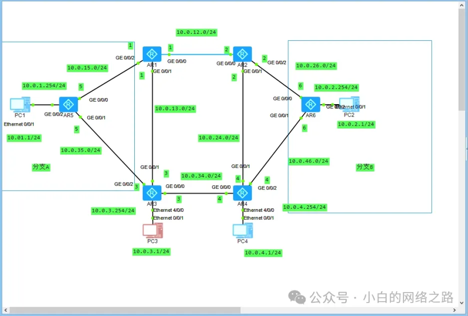
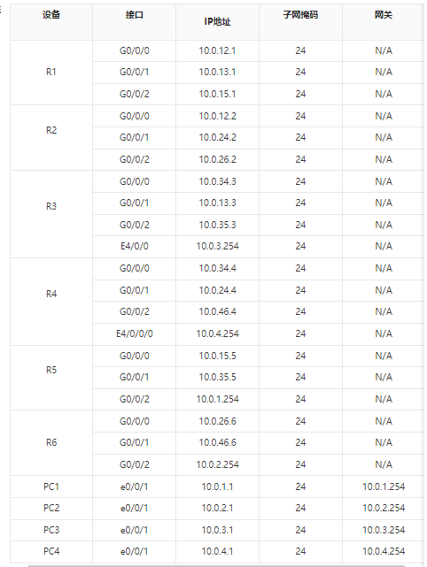
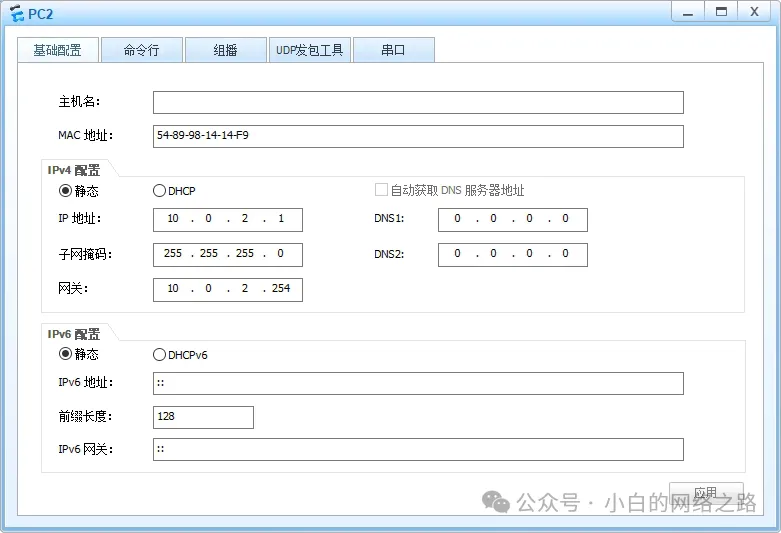
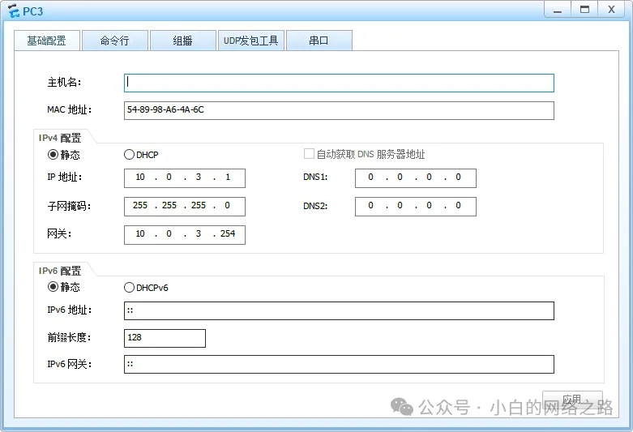
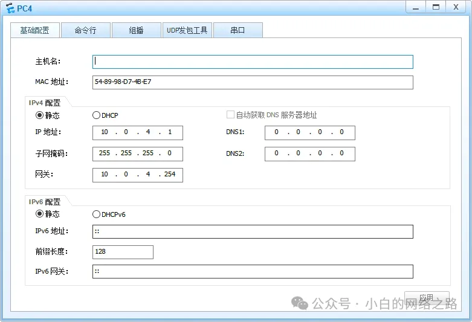
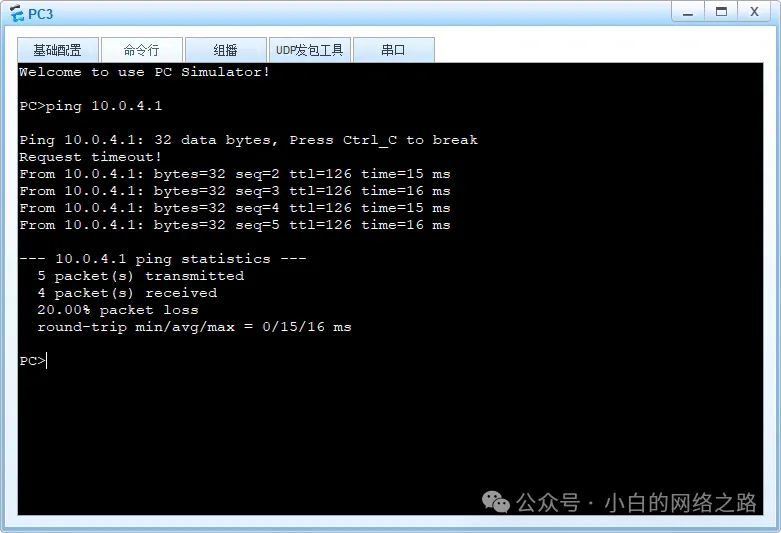
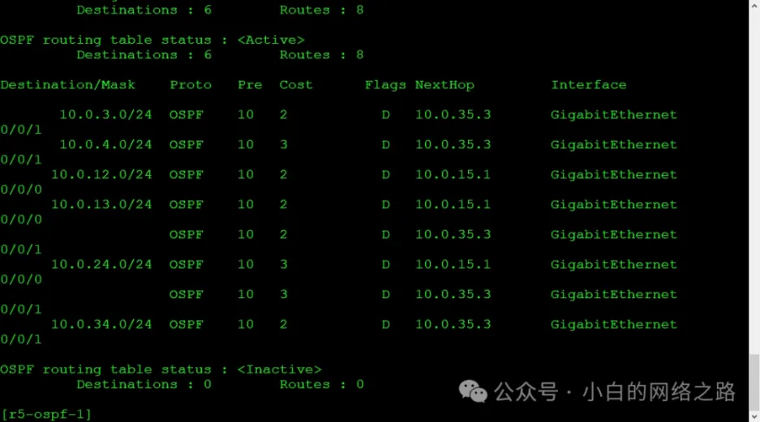
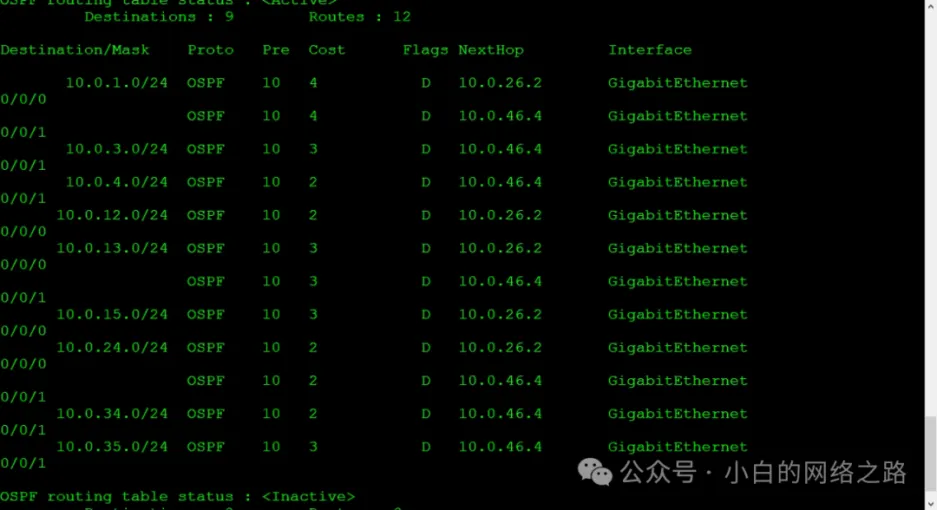
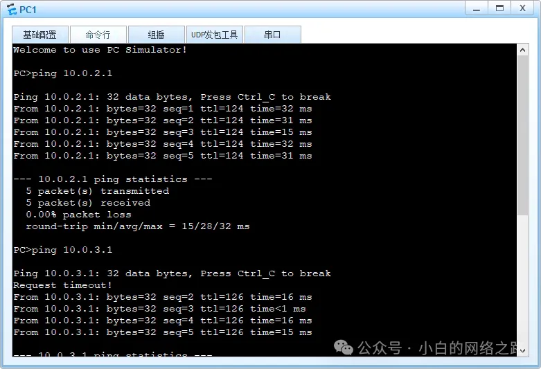

## 实验介绍

关于本实验的所需要的知识点补充

**原理概述**

在 OSPF（Open Shortest Path First）协议中，多区域（Multi-Area）是一种将整个自治系统（AS）划分为多个逻辑区域（Area）的设计概念。

在 OSPF 网络中，一个自治系统可以被划分为多个区域。每个区域内的路由器会维护一个独立的链路状态数据库，只存储与本区域相关的链路状态信息。

而区域之间的路由器仅存储与其他区域之间的连接信息，而不存储其他区域内的链路状态信息。<br />OSPF 多区域的设计带来了以下几个好处：

1. 减少链路状态数据库的规模：OSPF 的链路状态数据库是存储网络中所有路由器的链路状态信息，当网络规模较大时，链路状态数据库的大小可能会很大。通过划分为多个区域，可以将链路状态数据库分散到各个区域中，减小每个路由器的链路状态数据库的规模，降低存储和计算的负担。

2. 减少链路状态通告的范围：在多区域的 OSPF 网络中，每个区域只需通告本区域的链路状态信息给其他区域的路由器，减少了链路状态通告的范围和数量。这样可以减少链路状态通告的网络流量和处理开销。

3. 控制网络更新范围：区域划分可以帮助网络管理员更好地控制网络的拓扑更新。当一个区域发生拓扑变化时，只需通告给其他相关的区域，而不需要通告给整个自治系统，减少了网络更新的范围和影响。

4. 提高网络的可扩展性和性能：通过将自治系统划分为多个区域，可以更好地控制链路状态数据库大小、减少链路状态通告范围、降低网络更新的开销，从而提高网络的可扩展性和性能。

需要注意的是，OSPF 多区域设计需要合理划分区域边界和设计区域之间的连接，同时需要配置区域之间的路由器进行区域间路由的交换与转发。正确的区域规划可以提高 OSPF 网络的可管理性、可扩展性和性能。

<!--truncate-->

### 实验目的

- 理解配置OSPF 多区域的使用场景
- 掌握配置OSPF 多区域的方法
- 理解OSPF 区域边界路由器(ABR)的工作特点
### 实验内容
本实验模拟企业网络场景。R1、R2、R3、R4 为企业总部核心区域设备，属于区域 0，R5 属于新增分支机构 A 的网关设备，R6 属于新增分支机构 B 的网关设备。

PC-1 和 PC-2 分别属于分支机构 A 和 B，PC-3 和 PC-4 属于总部管理员登录设备，用于管理网络。在该网络中，如果设计方案采用单区域配置，则会导致单一区域 LSA 数目过于庞大，导致路由器开销过高，SPF 算法运算过于频繁。

因此网络管理员选择配置多区域方案进行网络配置，将两个新分支运行在不同的 OSPF 区域中，其中 R5 属于区域 1，R6 属于区域 2。

### 实验拓扑

### 实验编制



## 实验配置

### 基本配置








根据实验编址表进行相应的基本配置，并使用ping命令检测各直连链路的连通性。
```
[r1]int g0/0/0
[r1-GigabitEthernet0/0/0]ip add 10.0.12.1 24
[r1]int g0/0/1
[r1-GigabitEthernet0/0/1]ip add 10.0.13.1 24
[r1]int g0/0/2
[r1-GigabitEthernet0/0/2]ip add 10.0.15.1 24
[r2]int g0/0/0
[r2-GigabitEthernet0/0/0]ip add 10.0.12.2 24
[r2]int g0/0/1
[r2-GigabitEthernet0/0/1]ip add 10.0.24.2 24
[r2]int g0/0/2
[r2-GigabitEthernet0/0/2]ip add 10.0.26.2 24
[r3]int g0/0/0
[r3-GigabitEthernet0/0/0]ip add 10.0.34.3 24
[r3]int g0/0/1
[r3-GigabitEthernet0/0/1]ip add 10.0.13.3 24
[r3]int g0/0/2
[r3-GigabitEthernet0/0/2]ip add 10.0.35.3 24
[r3]int e4/0/0
[r3-Ethernet4/0/0]ip add 10.0.3.254 24
[r4]int g0/0/0
[r4-GigabitEthernet0/0/0]ip add 10.0.34.4 24
[r4]int g0/0/1
[r4-GigabitEthernet0/0/1]ip add 10.0.24.4 24
[r4]int g0/0/2
[r4-GigabitEthernet0/0/2]ip add 10.0.46.4 24
[r3]int e4/0/0
[r4-Ethernet4/0/0]ip add 10.0.4.254 24
[r5]int g0/0/0
[r5-GigabitEthernet0/0/0]ip add 10.0.15.5 24
[r5]int g0/0/1
[r5-GigabitEthernet0/0/1]ip add 10.0.35.5 24
[r5]int g0/0/2
[r5-GigabitEthernet0/0/2]ip add 10.0.1.254 24
[r6]int g0/0/0
[r6-GigabitEthernet0/0/0]ip add 10.0.26.6 24
[r6]int g0/0/1
[r6-GigabitEthernet0/0/1]ip add 10.0.46.6 24
[r6]int g0/0/2
[r6-GigabitEthernet0/0/2]ip add 10.0.2.254 24
```

### 配置骨干区域路由器
在公司总部路由器R1、R2、R3、R4上创建OSPF进程，并在骨干区域0视图下通告总部各网段。
```

[r1]ospf 1
[r1-ospf-1]area 0
[r1-ospf-1-area-0.0.0.0]network 10.0.12.0 0.0.0.255
[r1-ospf-1-area-0.0.0.0]network 10.0.13.0 0.0.0.255
[r2]ospf 1
[r2-ospf-1]area 0
[r2-ospf-1-area-0.0.0.0]network 10.0.12.0 0.0.0.255
[r2-ospf-1-area-0.0.0.0]network 10.0.24.0 0.0.0.255
[r3]ospf 1
[r3-ospf-1]area 0
[r3-ospf-1-area-0.0.0.0]network 10.0.13.0 0.0.0.255
[r3-ospf-1-area-0.0.0.0]network 10.0.34.0 0.0.0.255
[r3-ospf-1-area-0.0.0.0]network 10.0.3.0 0.0.0.255
[r4]ospf 1
[r4-ospf-1]area 0
[r4-ospf-1-area-0.0.0.0]network 10.0.34.0 0.0.0.255
[r4-ospf-1-area-0.0.0.0]network 10.0.24.0 0.0.0.255
[r4-ospf-1-area-0.0.0.0]network 10.0.4.0 0.0.0.255
```
配置完成后，测试总部内两台PC间的连通性



已经可以正常通信，骨干区域路由器配置完成。

### 配置非骨干区域路由器
在分支A的路由器R5上创建OSPF进程，创建并进入区域1，并通告分支A的相应网段。
```
[r5]ospf 1
[r5-ospf-1]area 1
[r5-ospf-1-area-0.0.0.1]network 10.0.15.0 0.0.0.255
[r5-ospf-1-area-0.0.0.1]network 10.0.35.0 0.0.0.255
[r5-ospf-1-area-0.0.0.1]network 10.0.1.0 0.0.0.255
```
在R1和R3上也创建并进入区域1视图，将与R5相连的接口进行通告。
```
[r1]ospf 1
[r1-ospf-1]area 1
[r1-ospf-1-area-0.0.0.1]network 10.0.15.0 0.0.0.255
[r3]ospf 1
[r3-ospf-1]area 1
[r3-ospf-1-area-0.0.0.1]network 10.0.35.0 0.0.0.255
```
配置完成后，查看OSPF邻居状态。
```
display ospf peer
```


可以观察到，现在R5与R1和R3的OSPF邻居关系建立正常，都为Full状态。<br />使用display ip routing-table protocol ospf命令查看R5路由表中的OSPF路由条目。
```
display ip routing-table protocol ospf
```


可以观察到，除OSPF区域2内的路由外，相关OSPF路由条目都已经获得。在拓扑中，R1和R3这两台连接不同区域的路由器称为ABR，即区域边界路由器，该类路由器设备可以同时属于两个以上的区域但其中至少一个端口必须在骨干区域内。

ABR是用来连接骨干区域和非骨干区域的，其与骨干区域之间既可以是物理连接，也可以是逻辑上的连接。<br />使用display ospf lsdb命令查看R5 的OSPF 链路状态数据库信息。
```
display ospf lsdb
```


可以观察到，关于其他区域的路由条目都是通过“Sum-Net”这类.SA获得，而这类LSA是不参与本区域的SPF算法运算的。

对公司另一分部B的路由器R6，和相应ABR设备R2、R4也做同样的配置。
```
[r6]ospf 1
[r6-ospf-1]area 2
[r6-ospf-1-area-0.0.0.2]network 10.0.26.0 0.0.0.255
[r6-ospf-1-area-0.0.0.2]network 10.0.46.0 0.0.0.255
[r6-ospf-1-area-0.0.0.2]network 10.0.2.0 0.0.0.255
[r2]ospf 1
[r2-ospf-1]area 2
[r2-ospf-1-area-0.0.0.2]network 10.0.26.0 0.0.0.255
[r4]ospf 1
[r4-ospf-1]area 2
[r4-ospf-1-area-0.0.0.2]network 10.0.46.0 0.0.0.255
```
配置完成，查看R6的OSPF 路由条目。



观察到可以正常接收到所有OSPF路由信息。<br />测试分支A和分支B的PC-1和PC-2连通性。




可以观察到，现在通信正常。至此，OSPF多区域配置完成。
