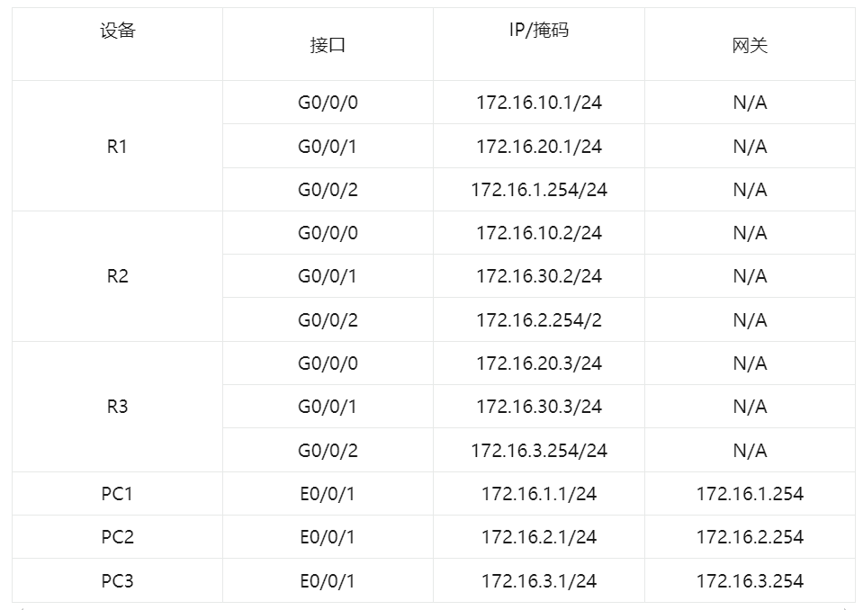

## 实验介绍: 

关于本实验的所需要的知识点补充

**OSPF**

OSPF 作为基于链路状态的协议，具有收敛快、路由无环、扩展性好等优点，被快速接受并广泛使用。

链路状态算法路由协议互相通告的是链路状态信息，每台路由器都将自己的链路状态信息(包含接口的 IP 地址和子网掩码、网络类型、该链路的开销等）发送给其他路由器，并在网络中泛洪，当每台路由器收集到网络内所有链路状态信息后，就能拥有整个网络的拓扑情况，然后根据整网拓扑情况运行 SPF 算法，得出所有网段的最短路径。

OSPF 作为基于链路状态的协议，具有收敛快、路由无环、扩展性好等优点，被快速接受并广泛使用。链路状态算法路由协议互相通告的是链路状态信息，每台路由器都将自己的链路状态信息(包含接口的 IP 地址和子网掩码、网络类型、该链路的开销等）发送给其他路由器，并在网络中泛洪，当每台路由器收集到网络内所有链路状态信息后，就能拥有整个网络的拓扑情况，然后根据整网拓扑情况运行 SPF 算法，得出所有网段的最短路径。

<!--truncate-->

OSPF 协议可以帮助这些路由器建立最佳的路径选择，以实现数据报文的传输。下面是 OSPF 的一些详细原理和功能：

1. 链路状态数据库（Link State Database）：每个 OSPF 路由器都会维护一个链路状态数据库，其中存储了网络中所有路由器的链路状态信息。这些信息包括邻居关系、链路带宽、延迟、可达性等。
2. 链路状态通告（Link State Advertisement）：OSPF 路由器通过使用特定的消息格式，将自己的链路状态信息广播给相邻的路由器。这些消息包含了该路由器对网络的拓扑图的描述。
3. SPF 计算（Shortest Path First）：每个 OSPF 路由器使用链路状态数据库中的信息来计算到达其他网络的最短路径。它使用 Dijkstra 算法，考虑链路带宽、延迟等参数来确定最佳路径。计算完成后，每个路由器都会拥有一张路由表，描述了到达各个网络的最佳路径。
4. 路由器交互与邻居关系建立：OSPF 路由器之间通过交换 Hello 消息来建立邻居关系。这些邻居关系的建立是必要的，因为只有与邻居路由器建立了连接，才能交换链路状态信息进行路由计算。
5. 路由更新与拓扑变化通知：OSPF 路由器会周期性地向邻居路由器发送链路状态更新信息，以通知其他路由器网络拓扑的变化。当有链路发生故障或网络拓扑发生变化时，路由器会立即发送通知，以便其他路由器更新他们的路由表。

综上所述，OSPF 通过收集和交换链路状态信息，计算最短路径，并建立和维护邻居关系，实现了动态路由的功能。它能够适应网络的变化，优化数据包的传输路径，提高网络性能和可靠性。

### 实验目的 

- 掌握OSPF 单区域的配置方法
- 理解OSPF 单区域的应用场景
- 掌握查看OSPF 邻居状态的方法

### 实验内容 

本实验模拟企业网络场景。

该公司有三大办公区，每个办公区放置了一台路由器，R1放在办公区A，A区经理的PC-1直接连接R1;

R2放在办公区B，B区经理的PC-2直接连接到R2;

R3放在办公区C，C区经理的 PC-3直接连接到R3;

3台路由器都互相直连,为了能使整个公司网络互相通信，需要在所有路由器上部署路由协议。

考虑到公司未来的发展（部门的增加和分公司的成立)，为了适应不断扩展的网络的需求，公司在所有路由器上部署OSPF协议，且现在所有路由器都属于骨干区域。

### 实验拓扑 


### 实验编址



## 实验配置

### 基本配置


根据实验编址表进行相应的基本配置，并使用ping命令检测各直连链路的连通性。

```
[r1]int g0/0/

[r1-GigabitEthernet0/0/0]ip add 172.16.10.1 24

[r1]int g0/0/1

[r1-GigabitEthernet0/0/1]ip add 172.16.20.1 24

[r1]int g0/0/2

[r1-GigabitEthernet0/0/2]ip add 172.16.1.254 24

[r2]int g0/0/0

[r2-GigabitEthernet0/0/0]ip add 172.16.10.2 24

[r2]int g0/0/1

[r2-GigabitEthernet0/0/1]ip add 172.16.30.2 24

[r2]int g0/0/2

[r2-GigabitEthernet0/0/2]ip add 172.16.2.254 24

[r3]int g0/0/0

[r3-GigabitEthernet0/0/0]ip add 172.16.20.3 24

[r3]int g0/0/1

[r3-GigabitEthernet0/0/1]ip add 172.16.30.3 24

[r3]int g0/0/2

[r3-GigabitEthernet0/0/2]ip add 172.16.3.254 24
```

### 配置单区域OSPF网络

1代表的是进程号，如果没有写明进程号，则默认是1。

接着使用area命令创建区域并进入OSPF区域视图，输入要创建的区域ID。由于本实验为OSPF单区域配置，所以使用骨干区域，即区域0即可。

```
[r1]ospf 1

[r1-ospf-1]area 0

[r1-ospf-1-area-0.0.0.0]network 172.16.10.0 0.0.0.255

[r1-ospf-1-area-0.0.0.0]network 172.16.20.0 0.0.0.255

[r1-ospf-1-area-0.0.0.0]network 172.16.1.0 0.0.0.255

[r2]ospf 1

[r2-ospf-1]area 0

[r2-ospf-1-area-0.0.0.0]network 172.16.10.0 0.0.0.255

[r2-ospf-1-area-0.0.0.0]network 172.16.30.0 0.0.0.255

[r2-ospf-1-area-0.0.0.0]network 172.16.2.0 0.0.0.255

[r3]ospf 1

[r3-ospf-1]area 0

[r3-ospf-1-area-0.0.0.0]network 172.16.20.0 0.0.0.255

[r3-ospf-1-area-0.0.0.0]network 172.16.30.0 0.0.0.255

[r3-ospf-1-area-0.0.0.0]network 172.16.3.0 0.0.0.255
```

配置完成后使用display ospf interface命令检查OSPF接口通告是否正确。

```
display ospf interface
```


### 检查OSPF单区域的配置结果

以R1为例使用display ospf peer 命令查看OSPF 邻居状态。

```
display ospf peer
```


通过这条命令，可以查看很多内容。例如，通过Router-ID可以查看邻居的路由器标识;通过Address可以查看邻居的OSPF接口IP地址;通过State可以查看目前与该路由器的OSPF邻居状态﹔通过Priority可以查看当前该邻居OSPF接口的DR优先级等。

使用display ip routing-table protocol ospf命令查看R1上的OSPF 路由表。


通过此路由表可以观察到，“Destination/Mask”标识了目的网段的前缀及掩码，“Proto”标识了此路由信息是通过 OSPF 协议获取的“Pre”标识了路由优先级，“Cost”标识了开销值，“NextHop”标识了下一跳地址，“Interface”标识了此前缀的出接口。

此时 R1的路由表中已经拥有了去往网络中所有其他网段的路由条用同样方法查看R2与R3的OSPF邻居状态。

再次测试主机PC-1与PC-2和PC-3间的通信。


## End